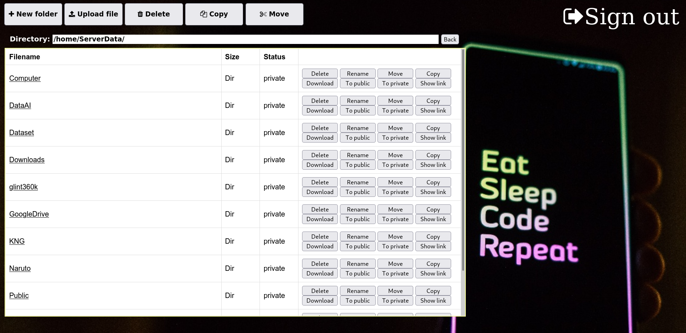
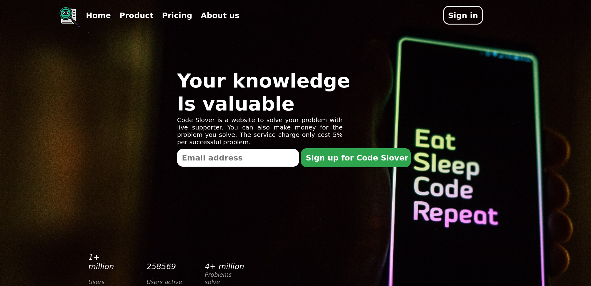
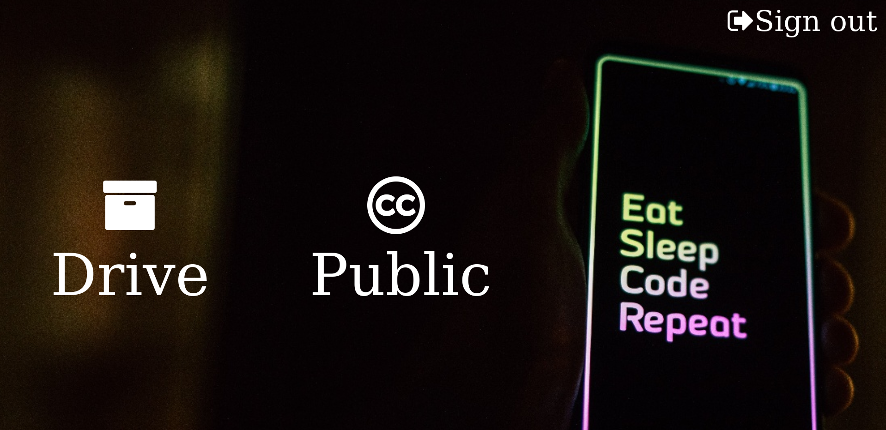
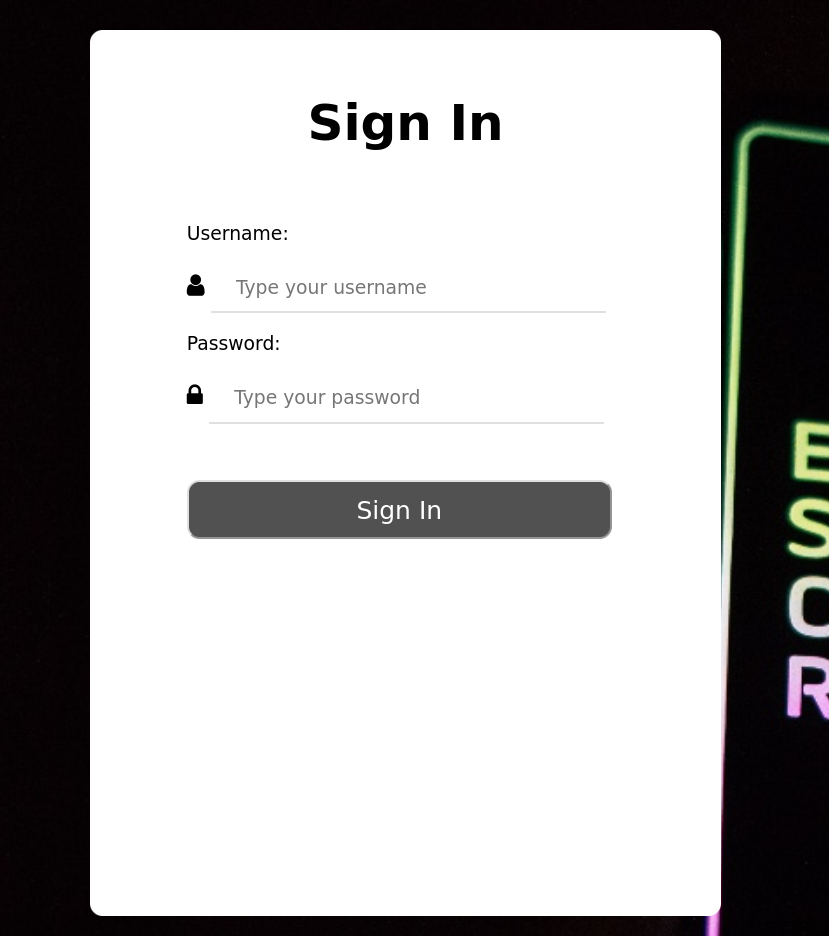

# [Raspberry Pi 4 Storage Server](https://github.com/namphuongtran9196/RasPStorageServer.git)




>  This repository helps you create a simple website to host a storage server on a Raspberry Pi 4. It is in development and only has upload, download, and shareable public links like google drive. The website server is developed by Django.

****

## Contents :bookmark_tabs:

* [Installation](##Installation)
* [Usage](##Usage)
* [Maintainers](##Maintainers)

## Installation :pizza:

To run this project, you need to install [Docker](https://www.docker.com/) with docker-compose on your Raspberry 4.

### Clone this repo :seedling:
```bash
git clone https://github.com/namphuongtran9196/RasPStorageServer.git
cd RasPStorageServer
```

### Build docker :bomb:
- These are some config you need to change before building docker file.
- Replace the server name in the nginx_uwsgi/server.conf with your server domain
```bash
line 8 server_name user.com www.user.com; # replace user.com and www.user.com
```
- Replace the server name in the server/settings.py with your server domain
```bash
line 14 ALLOWED_HOSTS = ["yourserver.com","www.yourserver.com"] # Replace yourserver.com and www.yourserver.com with your domain
```
- For security, please change the file secrit_key.txt with your secret_key.txt (greater than 50 character)
- Build your docker with the command:
```bash
docker build -t server -f Dockerfile . --force-rm
```
- Change the config for you server in docker-compose.yml. This is a sample config that I use for my Raspberry P400:
```bash
services:
  server:
    image: server
    container_name: server
    command: bash /home/Server/run.sh
    ports:
      - "80:80" # <This is the port for outside access to your server. You can achieve this port by creating a forwarding in your router>:80
      - "443:443" # <This port is for the SSL>:443
    volumes:
      - /media/user/Server:/home/ServerData # This is your main server storge folder
      - /home/user/Public:/home/Public # This is the folder that the server will look at to find out the file is public or private. This path should not be in /media/user/Server
```
- After finishing building your docker, you can turn on/off server by command
```bash
docker-compose -f docker-compose.yml up -d # start server
docker-compose -f docker-compose.yml down # stop server
```
- The last thing to make your server online is provide it a SSL certificate. To add SSL, you need to get inside the docker and create SSL certificate
```bash
docker exec -it server bash
# after login to docker, please run the following command
certbot --nginx
-> enter your email
-> acept the policy
-> choose your domain to add SSL, (user.com or 1)
-> wait for validating and successful message
-> exit the server by typing
exit
```
## Usage :eye_speech_bubble:
:fire:**Important**:fire:
- I make a default account for the server is user: **admin**, password: **admin**. Please access the admin page and create new admin account or change the admin passwork. The website is _**yourdomain.com/admin**_ or _**www.yourdomain.com/admin**_





## Maintainers
* [Nam Tran](https://github.com/namphuongtran9196)
